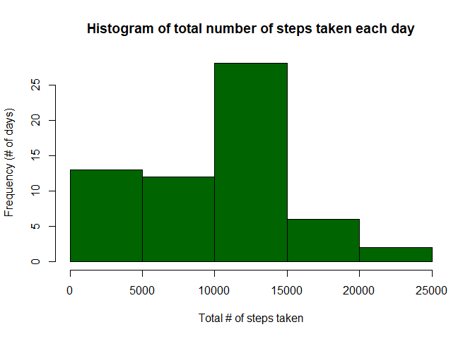
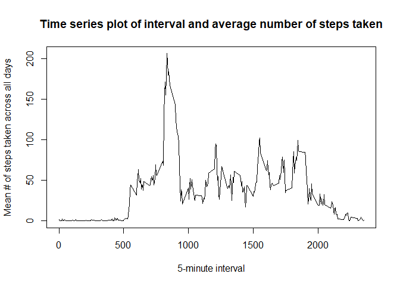
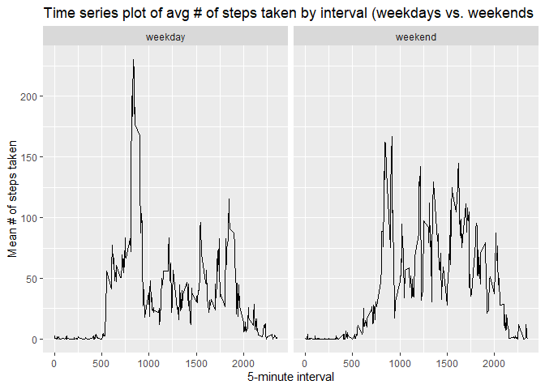

Reproducible Research: Peer Assessment 1 (Activity Monitoring Data)
================
Maya Gershtenson
2025-11-15

## Loading and preprocessing the data

First, I’ll load the dplyr and ggplot2 packages and the activity
dataset.

``` r
library(dplyr)
```

    ## 
    ## Attaching package: 'dplyr'

    ## The following objects are masked from 'package:stats':
    ## 
    ##     filter, lag

    ## The following objects are masked from 'package:base':
    ## 
    ##     intersect, setdiff, setequal, union

``` r
library(ggplot2)

getwd()
```

    ## [1] "C:/Users/mayag/OneDrive/Desktop/Data Science Foundations Using R/DSFoundations_R_Course5_PeerAssessment1"

``` r
data <- read.csv("activity.csv", header=TRUE)
```

Next, I’ll process/transform the data (if necessary) into a format
suitable for the analysis.

``` r
str(data)
```

    ## 'data.frame':    17568 obs. of  3 variables:
    ##  $ steps   : int  NA NA NA NA NA NA NA NA NA NA ...
    ##  $ date    : chr  "2012-10-01" "2012-10-01" "2012-10-01" "2012-10-01" ...
    ##  $ interval: int  0 5 10 15 20 25 30 35 40 45 ...

``` r
data$date <- as.Date(data$date, format = "%Y-%m-%d")

class(data$date)
```

    ## [1] "Date"

The ‘date’ variable was originally stored as a character data type, so I
converted it to date format. The other data types look correct (both
steps and interval are stored as integers) and missing values are
correctly coded as NA.

## What is the average total number of steps taken per day?

### Calculate the total number of steps taken per day.

To do this, I will create a new dataset called data_daily which takes
the sum of the ‘steps’ variable (ignoring missing values), grouped by
date.

``` r
data_daily <- data %>%
  group_by(date) %>%
  summarise(steps = sum(steps, na.rm = TRUE))

str(data_daily)
```

    ## tibble [61 × 2] (S3: tbl_df/tbl/data.frame)
    ##  $ date : Date[1:61], format: "2012-10-01" "2012-10-02" ...
    ##  $ steps: int [1:61] 0 126 11352 12116 13294 15420 11015 0 12811 9900 ...

### Make a histogram of the total number of steps taken each day.

``` r
hist(data_daily$steps, xlab = 'Total # of steps taken', 
        ylab = 'Frequency (# of days)', 
        main = 'Histogram of total number of steps taken each day',
        col = 'darkgreen')
```

<!-- -->

There were about 25 days with less than 10,000 steps taken per day and
about 10 days with 15,000 to 25,000 steps taken per day. The
distribution peaks at 10,000 to 15,000 steps per day, with over 25 days.

### Calculate and report the mean and median of the total number of steps taken per day.

First, I’ll look at a summary of the steps variable in the data_daily
dataset.

``` r
summary(data_daily$steps)
```

    ##    Min. 1st Qu.  Median    Mean 3rd Qu.    Max. 
    ##       0    6778   10395    9354   12811   21194

Next, I’ll use the mean and median functions to calculate the two values
(*though I’d expect to get the same values as I did using summary*).

``` r
mean(data_daily$steps)
```

    ## [1] 9354.23

The **mean** total number of steps taken per day is **9,354.23**. *This
is the same as the (rounded) mean displayed using the summary function.*

``` r
median(data_daily$steps)
```

    ## [1] 10395

The **median** total number of steps taken per day is **10,395**. *This
is the same as the median displayed using the summary function.*

## What is the average daily activity pattern?

First, I will create a new dataset called data_interval which takes the
mean of the ‘steps’ variable (ignoring missing values), grouped by
(5-minute) interval.

``` r
data_interval <- data %>%
  group_by(interval) %>%
  summarise(steps = mean(steps, na.rm = TRUE))

str(data_interval)
```

    ## tibble [288 × 2] (S3: tbl_df/tbl/data.frame)
    ##  $ interval: int [1:288] 0 5 10 15 20 25 30 35 40 45 ...
    ##  $ steps   : num [1:288] 1.717 0.3396 0.1321 0.1509 0.0755 ...

### Make a time series plot of the 5-minute interval (x-axis) and the average number of steps taken, averaged across all days (y-axis)

``` r
plot(data_interval$interval, data_interval$steps, type = "l", xlab = "5-minute interval", ylab = "Mean # of steps taken across all days", main = "Time series plot of interval and average number of steps taken")
```

<!-- -->

### Which 5-minute interval, on average across all the days in the dataset, contains the maximum number of steps?

Based on the time series plot, it looks to be ~800. But I’ll confirm
this using the code below.

``` r
max(data_interval$steps)
```

    ## [1] 206.1698

The maximum average number of steps within a 5-minute interval (across
all the days in the dataset) is 206.2.  
Now, I’ll first find the index of the maximum value for steps, then get
the corresponding value for interval.

``` r
max_steps_index <- which.max(data_interval$steps)

interval_at_max_steps <- data_interval$interval[max_steps_index]
print(interval_at_max_steps)
```

    ## [1] 835

The interval that contains the **maximum number of steps** (on average
across all days in the dataset) is minute **835**. *This is roughly as
expected based on the time series plot.*

## Imputing missing values

Note that there are a number of days/intervals where there are missing
values (coded as “NA”). The presence of missing days may introduce bias
into some calculations or summaries of the data.

### Calculate and report the total number of missing values in the dataset (i.e. the total number of rows with “NA”)

To see the number of rows with NA values, I will subtract the number of
complete cases from the total number of rows in the dataset.

``` r
rows_with_nas <- nrow(data) - sum(complete.cases(data))
print(rows_with_nas)
```

    ## [1] 2304

There are **2,304** rows with NA values in the dataset.  
I’ll also confirm which column(s) of the dataset have NA values by
retrieving the column names of any column with \> 0 NA values.

``` r
cols_with_nas <- colnames(data)[colSums(is.na(data)) > 0]
print(cols_with_nas)
```

    ## [1] "steps"

Only the **steps** column contains NA values.

### Devise a strategy for filling in all of the missing values in the dataset.

I will impute the mean number of steps for that 5-minute interval across
all days in the dataset to fill in the missing values in the steps
column.

### Create a new dataset that is equal to the original dataset but with the missing data filled in.

``` r
data_imputed <- data %>%
  group_by(interval) %>%
  mutate(steps = ifelse(is.na(steps), mean(steps, na.rm = TRUE), steps)) %>%
  ungroup()
```

After imputing missing values, I’ll check that the steps column in the
new data_imputed dataset does not have any NAs.

``` r
summary(data_imputed$steps)
```

    ##    Min. 1st Qu.  Median    Mean 3rd Qu.    Max. 
    ##    0.00    0.00    0.00   37.38   27.00  806.00

As expected, the steps column in the new dataset with missing values
filled in has no NA values.

### Make a histogram of the total number of steps taken each day.

First I’ll take the dataset with missing values filled in and calculate
the sum of steps for each day. Then I’ll make the histogram.

``` r
data_imputed_daily <- data_imputed %>%
  group_by(date) %>%
  summarise(steps = sum(steps))
            
hist(data_imputed_daily$steps, xlab = 'Total # of steps taken', 
        ylab = 'Frequency (# of days)', 
        main = 'Histogram of total number of steps taken each day (with missing data filled in)',
        col = 'darkblue')
```

<!-- -->

As before (pre-imputation), the distribution peaks at 10,000 to 15,000
steps per day, but now there are over 35 days in this bin (vs. just over
25 days before imputation).

## Calculate and report the mean and median total number of steps taken per day.

First, I’ll look at a summary of the steps variable in the
data_imputed_daily dataset.

``` r
summary(data_imputed_daily$steps)
```

    ##    Min. 1st Qu.  Median    Mean 3rd Qu.    Max. 
    ##      41    9819   10766   10766   12811   21194

Next, I’ll use the mean and median functions to calculate the two values
(*though I’d expect to get the same values as I did using summary*).

``` r
mean(data_imputed_daily$steps)
```

    ## [1] 10766.19

The **mean** total number of steps taken per day *after imputation of
missing values* is **10,766.19**. *This is the same as the (rounded)
mean displayed using the summary function.*

``` r
median(data_imputed_daily$steps)
```

    ## [1] 10766.19

The **median** total number of steps taken per day is **10,766**. *This
is the same as the median displayed using the summary function.*

*Question: Do these values differ from the estimates from the first part
of the assignment? What is the impact of imputing missing data on the
estimates of the total daily number of steps?* **Answer:** Yes, the
**mean** total daily number of steps is **higher** after imputation
(10,766 after imputation versus 9,354 before imputation). The **median**
total daily number of steps is also **higher** after imputation (10,766
after imputation versus 10,395 before imputation). So, the impact of
imputing missing data in this way is to **inflate the estimates of the
total daily number of steps**.

## Are there differences in activity patterns between weekdays and weekends?

Using the data_imputed dataset with the missing values filled in, I’ll
create a new factor variable with two levels – “weekday” and “weekend”
indicating whether a given date is a weekday or weekend day. To do this,
I’ll first get add a day of the week column, and then use this to create
the two-level factor variable.

``` r
data_imputed$day_of_week <- weekdays(data_imputed$date)

data_imputed$weekday_weekend <- ifelse(data_imputed$day_of_week %in% c("Saturday", "Sunday"), "weekend", "weekday")

data_imputed$weekday_weekend <- factor(data_imputed$weekday_weekend, levels = c("weekday", "weekend"))

table(data_imputed$weekday_weekend)
```

    ## 
    ## weekday weekend 
    ##   12960    4608

### Make a panel plot containing a time series plot of the 5-minute interval (x-axis) and the average number of steps taken, averaged across all weekday days or weekend days (y-axis)

First, I will create a new dataset called data_imputed_interval which
takes the mean of the ‘steps’ variable, grouped by weekday/weekend and
(5-minute) interval.

``` r
data_imputed_interval <- data_imputed %>%
  group_by(weekday_weekend, interval) %>%
  summarise(steps = mean(steps))
```

    ## `summarise()` has grouped output by 'weekday_weekend'. You can override using
    ## the `.groups` argument.

``` r
str(data_imputed_interval)
```

    ## gropd_df [576 × 3] (S3: grouped_df/tbl_df/tbl/data.frame)
    ##  $ weekday_weekend: Factor w/ 2 levels "weekday","weekend": 1 1 1 1 1 1 1 1 1 1 ...
    ##  $ interval       : int [1:576] 0 5 10 15 20 25 30 35 40 45 ...
    ##  $ steps          : num [1:576] 2.251 0.445 0.173 0.198 0.099 ...
    ##  - attr(*, "groups")= tibble [2 × 2] (S3: tbl_df/tbl/data.frame)
    ##   ..$ weekday_weekend: Factor w/ 2 levels "weekday","weekend": 1 2
    ##   ..$ .rows          : list<int> [1:2] 
    ##   .. ..$ : int [1:288] 1 2 3 4 5 6 7 8 9 10 ...
    ##   .. ..$ : int [1:288] 289 290 291 292 293 294 295 296 297 298 ...
    ##   .. ..@ ptype: int(0) 
    ##   ..- attr(*, ".drop")= logi TRUE

Now I’ll make the panel plot.

``` r
ggplot(data_imputed_interval, aes(x = interval, y = steps)) +
        geom_line() +
        facet_wrap(~ weekday_weekend) +
         labs(title = "Time series plot of avg # of steps taken by interval (weekdays vs. weekends", x = "5-minute interval", y = "Mean # of steps taken")
```

<!-- -->
